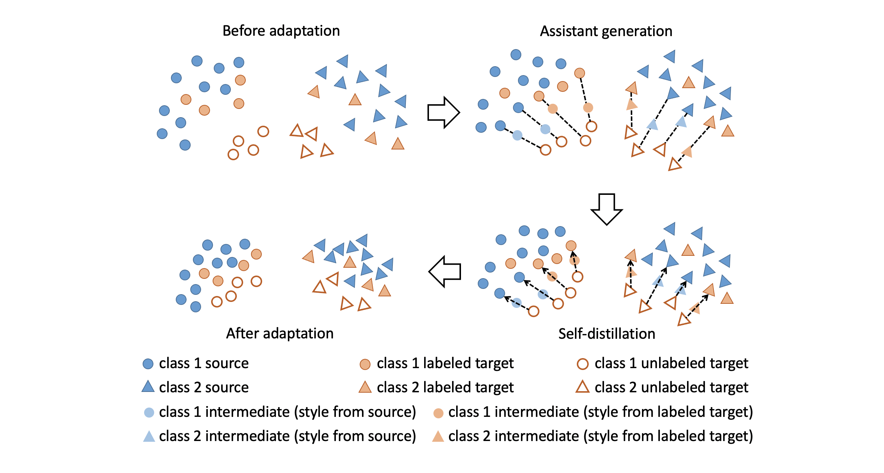

# [Semi-supervised Domain Adaptation via Sample-to-Sample Self-Distillation (WACV 2022)](https://arxiv.org/pdf/2111.14353.pdf)



### Acknowledgements
The code is based on the official pytorch implementation of [Semi-supervised Domain Adaptation via Minimax Entropy (ICCV 2019)](https://arxiv.org/pdf/1904.06487.pdf) (GitHub link: [SSDA_MME](https://github.com/VisionLearningGroup/SSDA_MME)).

Also, the official code of [Attract, Perturb, and Explore: Learning a Feature Alignment Network for Semi-supervised Domain Adaptation (ECCV 2020)](https://arxiv.org/pdf/2007.09375.pdf)
is used for several experiments in our paper (GitHub link: [APE](https://github.com/TKKim93/APE)).

### Environment
* CUDA 11.1
* Python 3.7.6
* Pytorch 1.8.0
* numpy / torchvision / tqdm / Pillow

You can create a conda environment through the commands below:
```bash
conda create -n s3d python=3.7.6
conda activate s3d
conda install pytorch==1.8.0 torchvision==0.9.0 cudatoolkit=11.1 -c pytorch -c conda-forge
pip install -r requirements.txt
```

### Dataset preparation
You can follow the instruction of [SSDA_MME](https://github.com/VisionLearningGroup/SSDA_MME) to prepare the datasets (DomainNet and Office-Home).

All datasets should be in the data folder.

For example, images of real domain from DomainNet are located in,
```bash
./data/multi/real/<category_name>
```

Also, the dataset split files of DomainNet are located in,
```bash
./data/multi
```

### Training
There are two stages for training the model.

#### Stage 1: Supervised learning using labeled datasets
```bash
python main_stage1.py --dataset multi --source real --target clipart --net resnet34 --save_check --num 1 --save_interval 1000 --exp_variation s1_s+t
```

#### Stage 2: Sample-to-sample self-distillation
```bash
python main_stage2.py --dataset multi --source real --target clipart --net resnet34 --save_check --num 1 --save_interval 1000 --s1_exp_variation s1_s+t --exp_variation s2_s3d --pseudo_interval 100 --kd_lambda 8 --sty_layer layer4
```
